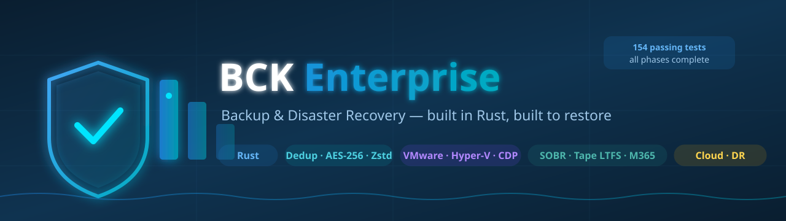
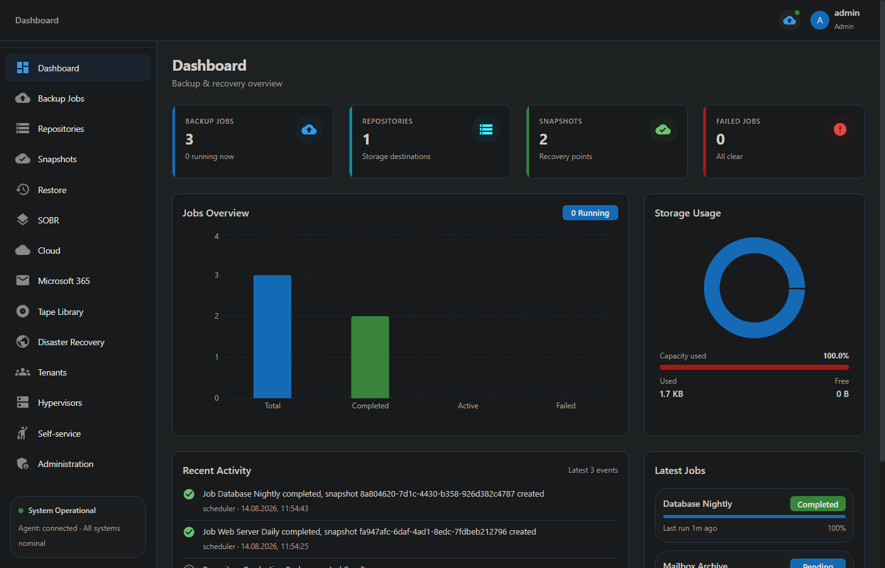
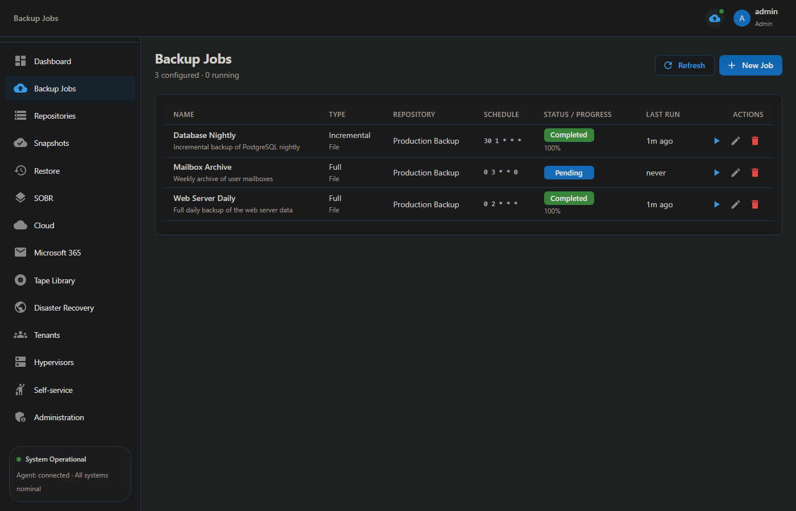
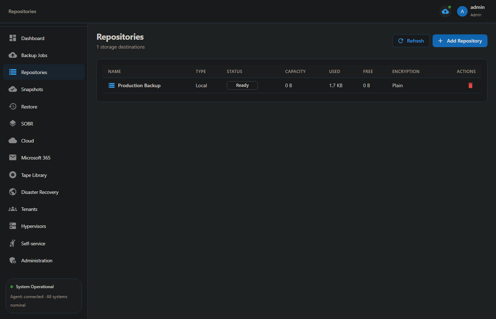
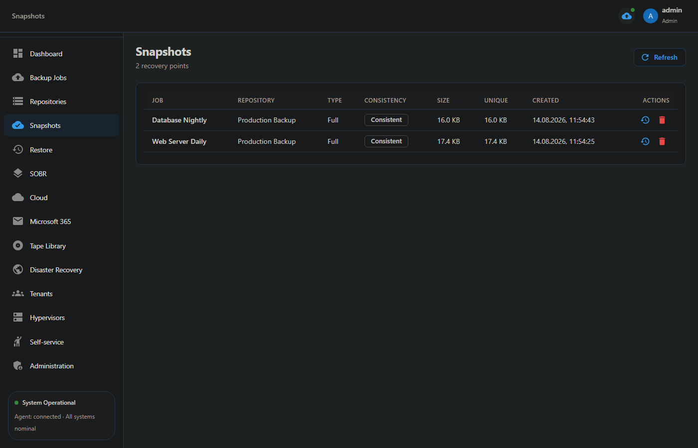
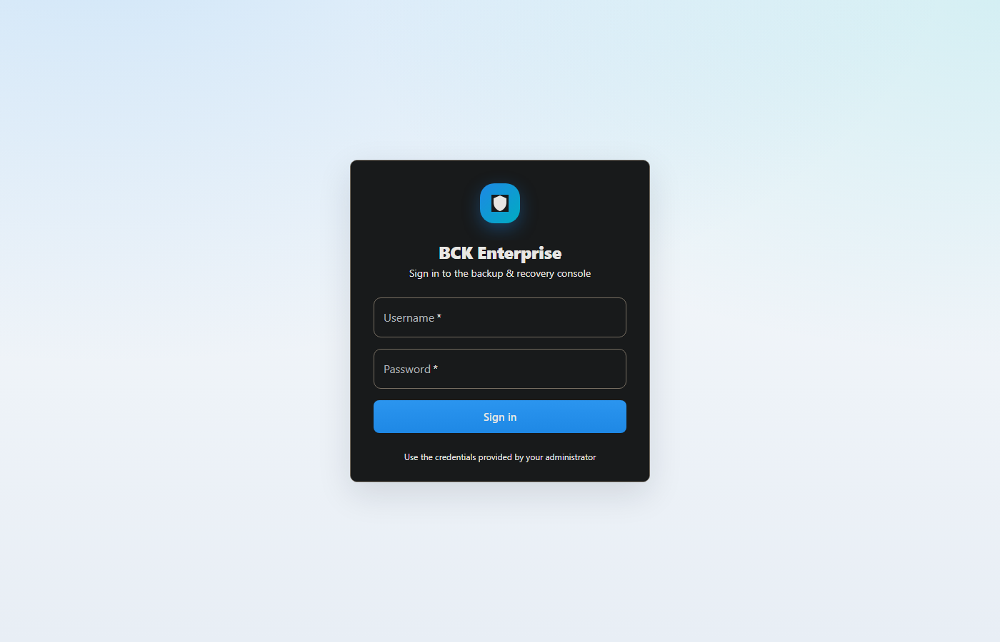

<div align="center">

# BCK Enterprise Backup — Source Code

[](https://github.com/ajjs1ajjs/BCK)
[](https://ajjs1ajjs.github.io/BCK/)
[](LICENSE)
[](https://github.com/ajjs1ajjs/BCK/actions/workflows/ci.yml)

> **Це репозиторій з вихідним кодом BCK Enterprise Backup.**
> Готовий продукт деплоїться в: **https://github.com/ajjs1ajjs/BCK**
> Офіційний сайт: **https://ajjs1ajjs.github.io/BCK/**

### Backup & Disaster Recovery for modern infrastructure
<p align="center">
  
</p>

**BCK Enterprise** — enterprise-grade backup and disaster recovery system (Veeam / Nakivo alternative), built entirely in Rust. Core engine, storage, REST + gRPC APIs, Web UI, CLI, agent and proxy; VMware/Hyper-V backup + instant recovery, SOBR, Tape, M365, Cloud, CDP, DR, SSO, audit, reports and multi-tenancy — all phases complete and covered by **188 passing tests**.

<p align="center">
  
  
  
  
  
  
  
</p>

</div>

---

## Screenshots

<p align="center">
  
  
  
  
</p>

<p align="center">
  
</p>

---

## Features

| Area | Capabilities |
|------|--------------|
| **Backup engine** | Scanner → chunker (XXH3) → dedup (SHA-256) → compress (LZ4/Zstd) → encrypt (AES-256-GCM / ChaCha20-Poly1305) |
| **Storage** | Local FS, S3 (SigV4), Azure Blob, GCS, Tape (LTFS) |
| **VMware / Hyper-V** | CBT/RCT changed-block tracking, snapshots, power on/off, **full VM backup jobs via REST**, **instant recovery** (VM boots from backup via NFS/iSCSI) |
| **Cloud** | AWS (EC2/EBS/RDS), Azure (VM/disk/SQL), GCP (GCE/disk/SQL), K8s (PVC); cloud restore via API |
| **Enterprise** | SOBR tiers + lifecycle, Tape LTFS, M365 (mailbox/OneDrive/SharePoint), CDP, DR failover, SureBackup validation |
| **Security & governance** | JWT + Argon2, SSO (OIDC + LDAP), audit log, SLA/CSV reports, multi-tenancy, self-service restore portal |
| **Interfaces** | REST API (Axum), gRPC (Tonic), Web UI (React + MUI), CLI, agent, backup proxy |

## Architecture

| Component | Description | Technology |
|-----------|-------------|-----------|
| **bckd** | Main daemon: REST API + gRPC + scheduler | Rust (Axum + Tonic) |
| **bck-agent** | Agent for protected machines | Rust |
| **bck-proxy** | Backup proxy (SAN, NFS, HotAdd) | Rust |
| **bck** | Management CLI | Rust (clap) |
| **web-ui** | Web management interface | React + TypeScript |
| **Database** | PostgreSQL (SQLite for single-node) | sqlx |
| **Storage** | Local FS, S3, Azure Blob, GCS, Tape | Rust |

### Ports

| Port | Service |
|------|---------|
| 9440 | REST API + Web UI |
| 9441 | gRPC API |

## Quick Start

> **Target platforms:** **Ubuntu / Debian** and **Windows**.
> Managed via the web console (`http://<host>:9440`).

```bash
# Build
cargo build --release

# Run daemon (SQLite standalone)
./target/release/bckd

# Login via CLI and check status
bck --server http://127.0.0.1:9440 status
```

Default web console: `http://localhost:9440`.

> **First login:** on first start the daemon seeds an `admin` account with a
> **randomly generated password**. The password is printed to the console once
> **and written to `bootstrap_admin.txt`** (mode `0600`) next to the data
> directory, so the one-line installer can display it on the terminal. Change
> it immediately after the first login, then delete `bootstrap_admin.txt`.
> There is no hardcoded `admin/admin`.

> **Secrets:** `BCK_JWT_SECRET`, `BCK_AGENT_TOKEN` and the encryption key are
> auto-generated and persisted with `0600` permissions under the data dir when
> not configured explicitly. For production set them explicitly (e.g. via
> `config.toml` / environment for the daemon).

> **TLS:** set `server.tls_cert` / `server.tls_key` in `config.toml` to serve
> HTTPS. Otherwise terminate TLS at a reverse proxy. gRPC (agents) is not
> TLS-terminated by the daemon; agents must authenticate with the shared
> `BCK_AGENT_TOKEN`.

> **Key protection:** the encryption key lives in `data/keys/encryption.key`
> (outside the backups directory) with `0600` permissions. Set
> `encryption.passphrase` in `config.toml` to wrap the key at rest with an
> Argon2id-derived key — a backup-data or key-file compromise alone is then not
> enough to decrypt your backups.

> **Access control:** the REST API enforces role-based access control.
> Everyone can read; **Operator**+ can create/run/delete jobs, **Operator** and
> **RestoreOperator** can restore, and **Admin**/**SuperAdmin** manage tenants
> and the admin portal. Cross-origin requests are denied unless the origin is
> explicitly allowed via `server.allowed_origins`.

> **Private storage endpoints:** custom S3 endpoints that resolve to `127.0.0.1`/`10.x`/`192.168.x` are blocked by default (SSRF hardening). For on-prem S3 set `BCK_ALLOW_PRIVATE_ENDPOINTS=1`.

> **Health:** `GET /api/v1/healthz` — liveness/readiness probe (checks DB, no auth).

## One-line Install & Update

Install **and update** with a single command — re-running the same command upgrades the daemon, agent, CLI, proxy and web UI **in place**, while preserving your configuration and backup data.

**Ubuntu / Debian** (installs Rust, build dependencies, binaries, web console, registers the systemd service):
```bash
curl -fsSL https://raw.githubusercontent.com/ajjs1ajjs/BCK/main/scripts/install.sh | sudo bash
```

**Windows** (PowerShell, run as Administrator — installs binaries, web console, registers the `bckd` Windows service):
```powershell
irm https://raw.githubusercontent.com/ajjs1ajjs/BCK/main/scripts/install.ps1 | iex
```

The installer (both platforms):

1. Download the latest GitHub release for the platform (or **build from source** when no release exists — on Windows this also bootstraps Rust, Git, protoc, Node.js and MSVC Build Tools as needed via `rustup`/`winget`).
2. Install `bckd`, `bck-agent`, `bck`, `bck-proxy` and the web console.
3. Create a default config — existing config is **preserved** on update.
4. Register `bckd` as a service (systemd on Linux, a Windows service on Windows) with restart-on-failure.

The same command is used for fresh installs and upgrades, so you can script regular updates:

```bash
# Ubuntu / Debian — add a weekly update
0 3 * * 0  curl -fsSL https://raw.githubusercontent.com/ajjs1ajjs/BCK/main/scripts/install.sh | sudo bash
```

```powershell
# Windows — re-run any time to update in place
irm https://raw.githubusercontent.com/ajjs1ajjs/BCK/main/scripts/install.ps1 | iex
```

**Verify installation:**

```bash
bck --server http://127.0.0.1:9440 status      # daemon health + stats
curl http://127.0.0.1:9440/api/v1/dashboard/stats
```

## CLI

```bash
# Jobs
bck job create "Daily Backup" /data my-repo
bck job list
bck job run <id>
bck job cancel <id>
bck job status <id>

# Repositories
bck repo list
bck repo add <name> <type> <path>

# Snapshots & restore
bck snapshot list <job_id>
bck snapshot delete <id>
bck restore <snapshot_id> <target> --files <file1,file2> --overwrite

# System
bck status
bck logs --tail
```

Enterprise management commands (SOBR, cloud, M365, DR, tenants, portal, hypervisors): see `bck --help`.

## Web UI

13 pages: Dashboard, Backup Jobs, Repositories, Snapshots, Restore, SOBR, Cloud, Microsoft 365, Tape Library, Disaster Recovery, Tenants, Hypervisors & VMs, Self-service portal (plus Administration with SSO / audit / reports).

## PWA (Progressive Web App)

Веб-консоль BCK — це повноцінний **PWA**: встановлюється на телефон/планшет/ПК як окремий застосунок, працює офлайн із закешованими assets через Service Worker (`vite-plugin-pwa`). Для встановлення відкрийте консоль `http://<host>:9440` у браузері та оберіть "Встановити додаток" / "Add to Home Screen".

## API

REST endpoints and gRPC service reference: [docs/API.md](docs/API.md).

## Development

```bash
# Check compilation
cargo check

# Run tests (188 in bck-core)
cargo test

# Run daemon in dev mode
RUST_LOG=debug cargo run -p bckd

# Run web UI dev server
cd web-ui && npm install && npm run dev
```

## License

MIT
